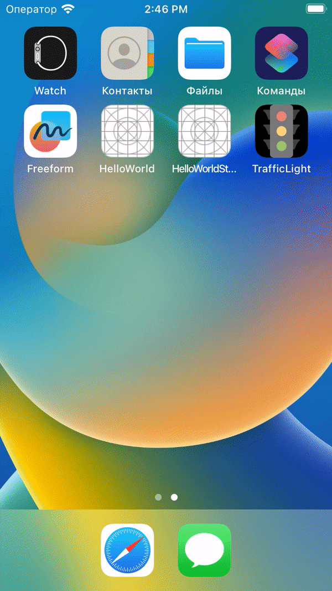

# TrafficLight
TrafficLight app.

The TrafficLight is the learning project. This app allows to switch the lights of the Traffic Light by Clicking the "START" button at first. Then the button is renamed to "NEXT"

